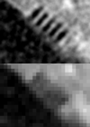

## RecView <A href="https://scicrunch.org/scicrunch/Resources/record/nlx_144509-1/SCR_016531/resolver">RRID:SCR_016531</A>
RecView is a program for tomographic reconstruction and image processing. It consists of over 25,000 lines of custom source codes in C++, CUDA C, OpenCL, and x86/x86_64 (x64) assembly languages including SIMD instructions up to AVX-512. RecView is designed for processing data obtained at the BL20B2, BL20XU, BL37XU, and BL47XU beamlines of the SPring-8 synchrotron radiation facility and also those taken at the 32-ID beamline of Advanced Photon Source (APS) of Argonne National Laboratory.  
Executables and manuals are available from the Releases pane of the <b><a href="https://github.com/mizutanilab/RecView">repository homepage</a></b>. The manuals are separately provided also in the docs folder. 

Three-dimensional structural analysis with microtomography (micro-CT) or nanotomography (nano-CT) is performed by recording two-dimensional x-ray images while rotating the sample. Then tomographic sections are calculated from the x-ray images with the convolution back-projection method. This calculation is repeated for each tomographic slice to reconstruct the entire three-dimensional structure. RecView is a program for the tomographic reconstruction calculation with graphical user interfaces. Multiple datasets can be continuously processed by using its queueing function. Zooming reconstruction (an example is shown left), Gaussian convolution for denoising, and many other procedures for image processing are also implemented. Resolution of real sample images can be estimated with the Fourier domain plot by using this program. 
 

## License
RecView is provided under the BSD 2-Clause License.

## References
<ul>
<li>Software itself 
 R. Mizutani et al. (2010). Microtomographic analysis of neuronal circuits of human brain. <i>Cerebral Cortex</i> <b>20(7)</b>, 1739-1748. 
 <a href="http://dx.doi.org/10.1093/cercor/bhp237">DOI</a> 
 <a href="http://www.ncbi.nlm.nih.gov/pubmed/19915092">PubMed</a> 
<li>Resolution estimation from real images 
R. Mizutani et al. (2016). A method for estimating spatial resolution of real image in the Fourier domain. <i>J. Microscopy</i> <b>261(1)</b>, 57-66.
<a href="http://dx.doi.org/10.1111/jmi.12315">DOI</a> 
<a href="http://www.ncbi.nlm.nih.gov/pubmed/26444300">PubMed</a> 
<a href="https://arxiv.org/abs/1609.02268">arXiv</a> 
</li>
<li>Test patterns 
R. Mizutani et al. (2008). Evaluation of the improved three-dimensional resolution of a synchrotron radiation computed tomograph using a micro-fabricated test pattern. <i>J. Synchrotron Radiat.</i> <b>15(6)</b>, 648-654. 
<a href="http://dx.doi.org/10.1107/S0909049508025685">DOI</a> 
<a href="http://www.ncbi.nlm.nih.gov/pubmed/18955773">PubMed</a> 
</li>
<li>Modulation transfer function 
R. Mizutani et al. (2010). Estimation of presampling modulation transfer function in synchrotron radiation microtomography. <i>Nuclear Instrum. Meth. A</i> <b>621(1-3)</b>, 615-619.
<a href="http://dx.doi.org/10.1016/j.nima.2010.03.111">DOI</a> 
<a href="https://arxiv.org/abs/1609.02269">arXiv</a>  
R. Saiga et al. (2018). Method for estimating modulation transfer function from sample images. <I>Micron</I> <B>105</B>, 64-69.
 <A href="https://doi.org/10.1016/j.micron.2017.11.009">DOI</A>
 <a href="https://www.ncbi.nlm.nih.gov/pubmed/29179010">PubMed</a> 
<A href="http://arxiv.org/abs/1711.09776">arXiv</A></li>
</ul>

## Release notes
The current Release contains 64-bit (x64) and 32-bit (x86) executables complied using Visual Studio 2017 C++ and CUDA Toolkit 10.0. If your PC is running 64-bit Windows and has NVIDIA Tesla, GeForce, Quadro,or RTX GPUs with 'compute capability' of 3.0 or higher (Kepler or later), the reconstruction calculation can be executed on the GPU.  
The present version can also be compiled with Visual Studio 2008 and CUDA Toolkit 5.5 by using gazoVS2008.sln file. An x64CUDA executable built with VS2008 is included in the current Release. This exe can run on GPUs with 'compute capability' of 2.0 (Fermi). A CUDA executable for x86 platform can be built with VS2008.  

A test dataset in TIFF format is also included in the Release. 

<UL>
  <LI>Build-250805. A minor debug in the TIFF reading routine.</LI>
  <LI>Build-240605. Minor debugs in determining the number of frames per dataset of data obtained with the syncreadout mode of Hamamatsu detectors. </LI>
  <LI>Build-230615. Updated the histogram and resolution plot dialogs to make the display compatible with the Screen DPI awareness. Added a function to automatically preprocess raw data when reading individual a*.img files. Added an ability to maintain contrast on the LAC scale when moving back and forth between image frames. Other misc updates.</LI> 
  <LI>Build-220422. Tomographic reconstruction code using AVX-512 instructions is now implemented. The AVX-512 assembler routine is enabled if both of AVX-512F and AVX-512DQ features are available. The previous rouitnes can also be chosen from the 'Computing config' dialog. The acceleration with AVX-512 was very subtle in the following example. 
    <UL>
    <LI>Tau (RTX A4000, 6144 cores, 1.56 GHz) = 0.029 nsec (0.22 sec for a 2048x2048 slice from 1800 projections)</LI>
    <LI>Tau (Core i5-11400 (x64), 6 threads, 2.6 GHz, AVX-512) = 0.22 nsec (1.67 sec for a 2048x2048 tomogram from 1800 projections)</LI>
    <LI>Tau (Core i5-11400 (x64), 6 threads, 2.6 GHz, AVX2) = 0.22 nsec (1.68 sec for a 2048x2048 tomogram from 1800 projections)</LI>
    </UL></LI>
  <LI>Build-211204. A bugfix to detect empty output.log file.</LI> 
  <LI>Build-210621. Frame loss detection routines were updated to deal with multiple frame loss. A bugfix in sample center calculation in the zoomed reconstruction.</LI> 
  <LI>Build-201127. Updates for 'syncreadout' mode of the Hamamatsu camera and also for several other minor functional improvements.</LI> 
  <LI>Build-191001. A bugfix in the CUDA memory freeing routine.</LI> 
  <LI>Build-190729. Default memory usage in the Computing config dialog is now set to 40%. This minimizes memory paging and boosts the batch recon calculation. 
    <UL>
    <LI>Tau (Quadro P4000, 1792 cores, 1.48 GHz) = 0.161 nsec (1.22 sec for a 2048x2048 slice from 1800 projections)</LI>
    </UL></LI>
  <LI>Build-190713. A bugfix in multithreading. Some improved GUI functions were implemented. CUDA stream is enabled by default. The source code can now be compiled also by using Visual Studio 2008 and CUDA Toolkit 5.5.</LI>  
  <LI>Build-190530. A checkbox to enablie/disable CUDA stream pipelining was implemented in the Tomography-Computing config dialog.</LI>  
  <LI>Build-190118. CUDA routines were revised by using the 'stream' pipelining to parallelize the calculation. Performances are: 
    <UL>
    <LI>Tau (Quadro K5000, 1536 cores, 706 MHz) = 0.130 nsec (0.98 sec for a 2048x2048 slice from 1800 projections)</LI>
    <LI>Tau (Core i5-4670 (x64), 4 threads, 3.4 GHz) = 0.38 nsec (2.9 sec for a 2048x2048 tomogram from 1800 projections)</LI>
    </UL></LI>
  <LI>Build-190111. On-the-fly reconstruction with which you can adjust the rotation axis in real time was implemented. If your PC has a sufficient computing power (over 1500 cores of GPU or 8 cores of AVX2-compatible CPU preferably Skylake or later), the axis position can be adjusted in real time using mouse wheel + shift key. Procedures for the data transfer between CPU and GPU were revised to accelerate the calculation.</LI>
   <LI>Build-190102. We moved to Visual Studio 2017 and CUDA Toolkit 10.0 in this release. CUDA executable on the x86 platform became unavailable. ATI executable is not compiled at present. The x86/x64 reconstruction kernels were revised by using the AVX2 instruction set. CUDA routines were revised to be compatible with the new CUDA Toolkit. </LI>
  <LI>Build-181222. Axis-scan images can be generated by specifying different center values with the same slice position. An alternative robust algorithm for least-square 3D fitting is now implemented. A bugfix in multithreading.</LI> 
  <LI>Build-180614. Bugfix of the pause/resume function in the queueing dialog.</LI>  
  <LI>Build-180505. Reslicing routine was revised to minimize memory usage and to allow users to specify the reslicing direction with a vector. Polygon lasso function was implemented for defining ROI of statistical analysis.</LI>  
  <LI>v5.4.1 (27 Jan 2018). Image analysis routines were updated. No revision were made in the offset CT kernel. Errors observed for some offset-CT data taken at SPring-8 were due to the 'conv.bat' files. Its workaround is described in the FAQ section below. Executable of this release is available only for x64 platforms because this is a very minor revision.</LI> 
  <LI>v5.4.0 (3 May 2017). Image analysis routines were updated. The offset CT routine is now under revision.</LI> 
  <LI>v5.3.0 (6 Jan 2017). Routines for <a href="https://github.com/mizutanilab/BluetoothDials">our dial input device</a> were implemented.</LI> 
  <LI>v5.2.0 (13 Nov 2016). Frame selection dialog was implemented. Routines for the sinogram generation were revised.</LI>
  <LI>v5.1.1 (released 18 Sep 2016). Reconstruction kernels for x86/x64 processors were updated using assembly code. The kernels are accelerated with vectorized instructions. Performances are:
    <UL>
    <LI>Tau (Quadro K4200, 1344 cores, 780 MHz) = 0.27 nsec (2.1 sec for a 2048x2048 tomogram from 1800 projections),</LI>
    <LI>Tau (Core i5-4670 (x64), 4 threads, 3.4 GHz) = 0.34 nsec (2.6 sec for a 2048x2048 tomogram from 1800 projections),</LI>
    <LI>Tau (Core i5-4670 (x86), 4 threads, 3.4 GHz) = 0.34 nsec (2.5 sec for a 2048x2048 tomogram from 1800 projections).</LI>
    </UL></LI>
  <LI>v5.1.0 (released 12 Sep 2016). OpenCL routines for ATI processors were updated. Performances are:
    <UL>
    <LI>Tau (Quadro K5000, 1536 cores, 706 MHz) = 0.23 nsec (1.75 sec for a 2048x2048 tomogram from 1800 projections),</LI>
    <LI>Tau (Quadro K4200, 1344 cores, 780 MHz) = 0.30 nsec (2.3 sec for a 2048x2048 tomogram from 1800 projections),</LI>
    <LI>Tau (Radeon HD 5450, 80 cores, 650 MHz) = 8.47 nsec (61.0 sec for a 2000x2000 tomogram from 1800 projections),</LI>
    <LI>Tau (Core i5-4670 (x64), 4 threads, 3.4 GHz) = 0.50 nsec (3.8 sec for a 2048x2048 tomogram from 1800 projections),</LI>
    <LI>Tau (Core i5-4670 (x86), 4 threads, 3.4 GHz) = 0.91 nsec (6.9 sec for a 2048x2048 tomogram from 1800 projections),</LI>
    <LI>Tau (Xeon E5-2609 (x64), 4 threads, 2.4 GHz) = 0.93 nsec (7.0 sec for a 2048x2048 tomogram from 1800 projections).</LI>
    </UL>  
Here, tau is the time constant required for one pixel projection. For example, one tomogram of 2000 x 2000 pixels from 1800 projection frames can be reconstructed in tau x 2000 x 2000 x 1800 sec.</LI>  
  <LI>v5.0.1 (released 5 Aug 2016). Reconstruction kernels were revised in order to improve sin/cos func precision in the reconstruction calculation. There would be no obvious difference in the appearance of reconstructed images, though pixel values are different from those of previous versions. The previous execulables are also still provided in the binary folder. Fourier domain plot for the resolution estimation can be generated from the "Analysis - Resolution plot" menu, without using the spread sheet software.</LI>
  <LI>v4.9.0 (released 21 Jul 2016). APS-ANL data in HDF5 format are now supported. This page was moved here from our laboratory site.</LI>
  <LI>v4.7.0 (released 13 Nov 2015). A dedicated routine for resolution estimation plot (J. Microsc. 261, 57-66, 2016) was implemented. CSV files now can be generated from 'Analysis==>Resolution plot' menu. ATI processors are not supported in this release.</LI>
  <LI>v4.5.0 (released 6 Jan 2015). Update to support recent output.log format. Fourier transformations now can be generated from Tomography menu. A faster HIS-file reading routine was also implemented. A problem with the tilt angle direction of x64 reconstruction routine was fixed. User interfaces were updated.</LI>
  <LI>v4.0.2 (released 22 Oct 2013). Back projection routines running on CUDA processors were updated to support the CUDA 5.5 computing environment. The CUDA version for x64 platforms was also included from this release. Queues from multiple RecView instances are now executed sequentially.</LI> 
  <LI>v3.0.0 (released 27 May 2010). Back projection routines running on Tesla, GeForce, Quadro processors were updated to support the CUDA 3.0 computing environment. The OpenCL 1.0 routines for ATI Radeon, FireStream or FirePro processors were also implemented. Performances are:
    <UL>
    <LI>Tau (448 cores, 607 MHz) = 0.0813 nsec (23.4 sec for a 8000x8000 tomogram from 4500 projections) by using GeForce GTX470 with 1.28 GB of GDDR5 memory,</LI>
    <LI>Tau (112 cores, 500 MHz) = 0.243 nsec (1.75 sec for a 2000x2000 tomogram from 1800 projections) by using Quadro FX 3700 with 512 MB of GDDR3 memory,</LI>
    <LI>Tau (80 cores, 650 MHz) = 2.86 nsec (20.6 sec for a 2000x2000 tomogram from 1800 projections) by using Radeon HD 5450 with 512 MB of DDR2 memory,</LI>
    <LI>Tau (4 threads, 3.16 GHz) = 0.825 nsec (5.94 sec for a 2000x2000 tomogram from 1800 projections) by using Xeon E5410 (x86),</LI>
    <LI>Tau (4 threads, 3.16 GHz) = 0.808 nsec (5.82 sec for a 2000x2000 tomogram from 1800 projections) by using Xeon E5410 (x64).</LI>
    </UL>
Here, tau is the time constant required for one pixel projection. For example, one tomogram of 2000 x 2000 pixels from 1800 projection frames can be reconstructed in tau x 2000 x 2000 x 1800 sec. Drift correction options were also provided in this revision.</LI>
  <LI>v2.0.5 (released 9 Feb 2009). Back-projection routines running on Tesla, GeForce or Quadro processors supporting the CUDA programming environment were implemented. The x86 and x64 assembler routines were also revised. Performances are:
    <UL>
    <LI>Tau (112 cores, 500 MHz) = 0.314 nsec (2.28 sec for a 2000x2000 tomogram from 1800 projections) using a Quadro FX 3700,</LI>
    <LI>Tau (3.16 GHz) = 0.633 nsec (4.56 sec for a 2000x2000 tomogram from 1800 projections) using Core2Duo (x86, 2 threads), or tau = 1.336 nsec (x86, single thread),</LI>
    <LI>Tau (3.16 GHz) = 0.802 nsec (5.77 sec for a 2000x2000 tomogram from 1800 projections) by using Xeon E5410 (x86, 4 threads), or tau = 1.724 nsec (x86, single thread),</LI>
    <LI>Tau (3.16 GHz) = 0.768 nsec (5.53 sec for a 2000x2000 tomogram from 1800 projections) by using Xeon E5410 (x64, 4 threads), or tau = 1.651 nsec (x64, single thread).</LI>
    </UL></LI>
  <LI>v2.0.0 (released 21 Jan 2009). x64 platform is now supported. The x64 version can generate larger tomograms upto 106 x 106 pixels. Performance: tau(3.16 GHz) = 0.789 nsec using Xeon E5410 (x64, 4 threads). Performace of x86 version: tau(3.16 GHz) = 0.849 nsec using Core2Duo (x86, 2 threads), or tau = 1.395 nsec (x86, single thread).</LI>
  <LI>v1.0.4 (released 1 Apr 2008). Multithreaded reconstruction routine was implemented. This function is partially written in x86 machine language, allowing faster execution of the reconstruction calculation.</LI>
  <LI>v1.0.0 (released 6 Mar 2008).</LI>
</UL>

## How to use
Concise help can be found in the 'Help'-'About' menu. We believe that this program is self-explanatory, but the following tips would be helpul.

<B>Installation</B>  
Download x64 or x86 executable from the Release pane of the <b><a href="https://github.com/mizutanilab/RecView">repository homepage</a></b> and place it any folder you like. 

<B>Execution</B>  
Double click the 'RecView' executable.

<B>Open data files</B>  
From the menu bar, select 'File'-'Open' and choose an image file.

<B>Computing environment</B>  
The GPU/CPU processors and memory usage can be specified in the 'Tomography'-'Computing config' dialog.

<B>Reconstruction</B>  
Open 'Tomography'-'Reconstruction' dialog. Enter slice position in the 'From' or 'To' field. Tomographic sections can be generated with 'Show image' buttons. You can adjust the sample axis position using the 'Rotation center' field. 'Batch' invokes the reconstruction calculations through the 'From' to 'To' sections. Several options are also available, such as the 'Offset CT' checkbox to switch the reconstruction kernel to the offset-CT mode. Many other options including the zooming reconstruction can be found in the 'Options' dialog. 

<B>Trimming or reformatting images</B>  
The 'Tomography'-'Histogram/conversion' dialog provides several tools for trimming, converting to 8-bit TIFF, removing surrounding capillary pixels, and so on.

## Frequently asked questions
<OL>
  <LI><b>System requirements</b></LI>
    RecView can be executed on a Windows PC running Windows 10 or 11 with an x86 or x64 CPU and a local storage. Its reoncstruction kernel can run either on CPU or GPU. The CUDA kernel can be executed on NVIDIA GPU processors with 'compute capability' 3.0 or higher (this corresponds to Kepler processors or later). If you run RecView on a legacy CPU without using GPU, we recommend CPUs released after approx 2005 (i.e., Pentium4 / Athlon64 or later), because SSE2 SIMD instructions are used in the x86/x64 reconstruction kernel. This is not a requirement, but the performance may differ by a factor of 2-3 with or without the SIMD. The x86/x64 kernel also uses AVX2 or AVX-512 instructions if available.   
  <LI><b>Manuals</b></LI>
    Step-by-step manuals in English and Japanese are included in the Release. They are also separately provided in the docs folder.  
  <LI><b>What kind of data can be processed?</b></LI>
    RecView is designed for the reconstruction of tomographic data obtained at SPring-8 and APS. However, any kind of data can be processed. Please contact the author if you have problems in using this program with your own data. Dataset requirements are:
    <UL>
      <LI>We use file names beginning with alphabet characters followed by sequential frame number, such as 'q0005.tif' for frame #5.</LI>
      <LI>Place a dark-field image 'dark.tif' in the dataset folder.</LI>
      <LI>Prepare a paprameter file 'output.log' in plain text format. You can find examples in the docs folder and also in the test dataset. This file has four fields: 
<pre>
frame#      time(msec)     angle(deg) 0=flatfield/1=sample
00001       00012.46900    000.0000        0
00002       00019.26600    000.1000        1
00003       00021.34400    000.2000        1
00004       00023.43800    000.3000        1
00005       00025.51600    000.4000        1
...
01890       05298.43800    180.0000        1
01891       05310.65700    180.0000        0</pre>
          Spreadsheet softwares work well for manually generating this 'output.log' file. The 'time' fields are used for interpolating the trend of flatfield pixel intensities.  The output.log files of some SPring-8 sessions list angle in pulses instead of angle in degrees. RecView can recognize both formats.
      </LI>
    </UL> 
  <LI><b>RecView returns an error when processing offset-CT data taken at SPring-8.</b></LI>
    In the offset CT, the sample is rotated by 360 degrees. Start and stop angles of the sample rotation vary depending on your setup, such as -180 to 180 deg or 0 to 360 deg. If the 'stop angle' was not exactly 360 deg in your offset-CT experiment, 'conv.bat' file seems to have incorrect contents. You have to edit it manually before the reconstruction calculation. Or you can find examples of conv.bat and output.log files in the 'docs' folder.   
  <LI><b>How to try test dataset in the Release.</b></LI>
    <UL>
      <LI>Extract all files in the archived test dataset.</LI>
      <LI>Open one of TIFF files (such as Q0005.tif) using RecView.</LI>
      <LI>Open 'Tomography'-'Reconstruction...' dialog.</LI>
      <LI>Enter '380' in the 'From'-'Layer' field.</LI>
      <LI>Enter '311' in the 'From'-'Rotation center' field.</LI>
      <LI>Click 'Show image' button. In seconds, a cross section of an aluminum wire with a square-wave pattern carved on its surface will be shown.</LI>
    </UL> 
  <LI><b>Does RecView make network connections?</b></LI>
      No, never. However, remote folders such as workgroup PCs are searched when you open files. It's probably one of default functions of Windows depending on your environment.  
  <LI><b>My samples showed drifts in reconsturcted images. How can I prepare biological samples best suited for the synchrotron radiation experiment? </b></LI>
      Please see the following: 
      R. Saiga and R. Mizutani (2018). Preparation of soft tissue samples for synchrotron radiation microtomography and nanotomography. <I>Protocol Exchange</I> DOI: 10.1038/protex.2018.085.
        <A href="http://dx.doi.org/10.1038/protex.2018.085">DOI</A></li>  
  <LI><b>How to prepare a development environment for RecView.</b></LI>
      You need Visual Studio 2017 and CUDA Toolkit 10.0 to compile the source code. The 'Desktop Environment with C++' package and 'Visual C++ MFC' component of VS2017 should be installed. You may also need to update GPU driver to the latest one to run the CUDA reconstruction kernel. 
      <UL>
        <LI>Install 'Visual Studio Comunity 2017' from the <a href="https://visualstudio.microsoft.com/thank-you-downloading-visual-studio/?sku=Community">Microsoft site</a>. Choose 'Desktop Development with C++' and include the 'Visual C++ MFC' component. We recommend to include language packs of English(US) and Japanese. </LI>
        <LI>Download 'CUDA Toolkit 10.0' from the <a href="https://developer.nvidia.com/cuda-toolkit-archive">NVIDIA Toolkit site</a> and istall. The installation will associate the toolkit with Visual Studio.</LI>
        <LI>If your local PC has NVIDIA GPU, download the latest GPU driver from the <a href="https://www.nvidia.co.jp/Download/index.aspx">NVIDIA driver site</a> and install. It is not recommended to update the driver using Device Manager of Windows Control Panel.</LI>
        <LI>Open Visual Studio solution file 'gazo.sln'. Choose your platform (x64 or Win32) and build configuration (Release or CUDA_Release) from the toolbar and generate executable from the 'Build' menu. You can find an .exe file under the 'x64' or 'Win32' folder. The recent CUDA Toolkit seems not compatible with the Win32 (x86) platform.</LI>
        <LI>Another configuration 'CUDAFFT_Release' is also provided in the solution file. In this configuration, Fourier transform calculations in the deconvolution step can be executed on the GPU, though its elapsed time is comparable to that of the x86/x64 CPU. Dynamic link libraries ('cudart64_100.dll' and 'cufft64_100.dll') must be placed in the folder where the CUDAFFT executable is placed. The library files are available as part of the CUDA Toolkit.</LI>
      </UL> 
</OL>

## Contact
Ryuta Mizutani, Dr., Prof.  
Department of Applied Biochemistry  
School of Engineering, Tokai University  
Kitakaname 4-1-1, Hiratsuka, Kanagawa 259-1292, Japan  
E-mail ryuta(at)tokai.ac.jp  
https://mizutanilab.github.io/ 
<A href="http://www.linkedin.com/pub/ryuta-mizutani/79/832/115">Linkedin</A> - 
<A href="http://www.youtube.com/user/mizutaniLab">YouTube</A>
 
